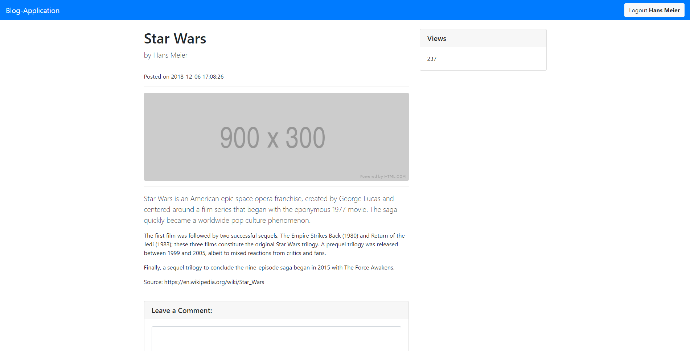
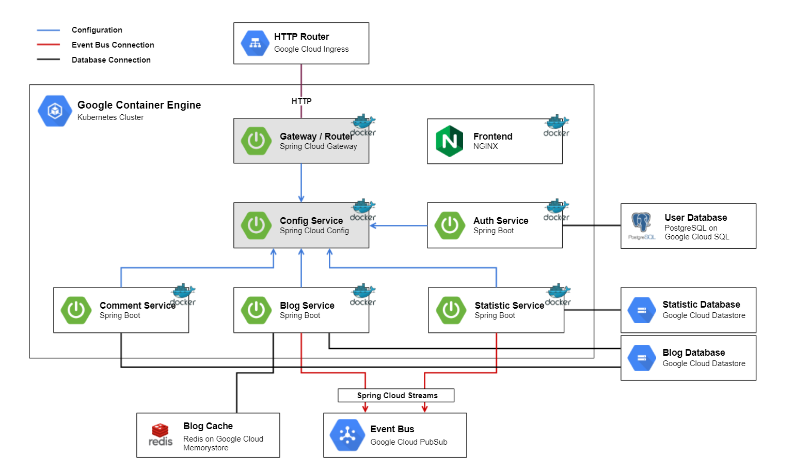

# Architecture Prototype of a Spring Cloud Application on GCP - Blog Application

The blog application is a fictitious blog system demonstrating microservices as well as domain-driven-design. 

The system provides the functionality of creating blogs, posts and comments as well as user authentification and authorisation.
Furthermore, statistics over activities are kept.



## Architecture Overview
The following diagram shows an overview of the blog microservices, datastores and the interaction between these components, as well as the used technologies of each.


### Microservices and components running in a [Kubernetes Cluster](https://cloud.google.com/kubernetes-engine/):

* **[Config Service](configmicroservice)**

    The [Config Service](./configmicroservice) backend is a [Spring Cloud Config](https://spring.io/projects/spring-cloud-config) server. It provides the configuration for most of the microservices. 
    On any time, they can pull their configuration.

* **[Blog Service](blogmicroservice)**

    The [Blog Service](./blogmicroservice) backend is a [Spring Boot](https://spring.io/projects/spring-boot) application. It is the core domain and manages the blogs and posts.
    On startup it loads the configuration of the [Config Service](./configmicroservice).
    To store the blog data, it uses the `Blog Database`, a [Google Cloud Datastore](https://cloud.google.com/datastore/) and caches the blog data in `Blog Cache` a [Google Cloud Memorystore](https://cloud.google.com/memorystore/) for [Redis](https://redis.io/). 
    It also interacts with the `Event Bus`, a [Google Cloud PubSub](https://cloud.google.com/pubsub/), where other microservices can subscribe to.

* **[Auth Service](authmicroservice)**

    The [Auth Service](./authmicroservice) backend is a [Spring Boot](https://spring.io/projects/spring-boot) application. It is responsible for the creation and verification of user accounts over [JSON Web Tokens (JWT)](https://jwt.io/).
    On startup it loads the configuration of the [Config Service](./configmicroservice).
    To store the user data, it uses the `User Database`, a [PostgreSQL](https://www.postgresql.org/) database in [Google Cloud SQL](https://cloud.google.com/sql/).

* **[Comment Service](commentmicroservice)**

    The [Comment Service](./commentmicroservice) backend is a [Spring Boot](https://spring.io/projects/spring-boot) application. It is responsible for the comments of the blog posts.
    On startup it loads the configuration of the [Config Service](./configmicroservice).
    To store the comment data, it uses the `Blog Database`.

* **[Statistic Service](statisticmicroservice)**

    The [Statistic Service](./statisticmicroservice) backend is a [Spring Boot](https://spring.io/projects/spring-boot) application. It is responsible for keeping statistic over blog activities, such as viewing a blog post.
    On startup it loads the configuration of the [Config Service](./configmicroservice) and subscribes to the `Event Bus` to get the events.
    To store the statistic data, it uses the `Statistic Database`, a [Google Cloud Datastore](https://cloud.google.com/datastore/).

* **[Gateway / Router](gatewaymicroservice)**

    The [Gateway / Router](./gatewaymicroservice) backend is a [Spring Cloud Gateway](http://spring.io/projects/spring-cloud-gateway) server. It is responsible for the routing to the [Frontend](./frontend) as well to the microservices.
    On startup it loads the configuration of the [Config Service](./configmicroservice).
    The [Gateway / Router](./gatewaymicroservice) is accessible through the `HTTP Router`, a [Google Cloud Ingress](https://cloud.google.com/kubernetes-engine/docs/concepts/ingress).

* **[Frontend](frontend)**

    The [Frontend](./frontend) is a static [Angular](https://angular.io/) webpage with [Bootstrap](https://getbootstrap.com/), served by a [NGINX](https://www.nginx.com/) webserver.

## Getting Started

The detailed instruction for each service can be found in the README file of the associated subfolder.

### Prequisites for cloud build
* [Docker](https://www.docker.com/) installed and runnable without `sudo` (https://docs.docker.com/install/linux/linux-postinstall/)
* [Google Cloud SDK](https://cloud.google.com/sdk/) installed
* [Google Cloud Account](https://cloud.google.com/) (You'll get a 300$ test budget if you connect a new account to GCP)
* Java 8 installed
* Node (npm) installed

### Configure Google Cloud SDK

Authorize gcloud:
```
gcloud auth login
gcloud auth application-default login
```
Install kubectl
```
gcloud components install kubectl
```
Configure docker
```
gcloud auth configure docker
```

## Build

> Make sure that the prequisites are fullfilled

Open `variables.properties` and change `GCP_PROJECT_NAME` to a unique name, which isn't used in any other google cloud project.


### Local Build

> NOTE: The `setup-local` script may take up to 5 minutes.

1. Run `setup-local`
2. The script will open the webbrowser for your project to activate payment for this project. Press any key to continue.
3. Navigate to http://localhost:8181 to open the Blog-Application.

The local build will generate following:
* Google Cloud Project with name and zone configured in `variables.properties` and payment enabled
* App Engine
* Enable datastore.googleapis.com API
* Run projects locally

The Google Cloud Project is on the local build only needed for the `Datastore`.

### Cloud Build

> NOTE: The `setup-cloud` script may take up to 20 minutes.

1. Run `setup-cloud.bat` or `setup-cloud.sh`
2. The script will open the webbrowser for your project to activate payment for this project. Press any key to continue when payment is activated.
3. Go to https://console.cloud.google.com to your project (you may must reload the whole page to see kubernetes cluster). 
	Navigate to `Kubernetes Engine > Services` and click on the `gateway-microservice` url to open the Blog-Application.

The cloud build will generate following:
* Google Cloud Project with name and zone configured in `variables.properties` and payment enabled
* App Engine
* Enable `compute.googleapis.com` API
* Enable `container.googleapis.com` API
* Enable `datastore.googleapis.com` API
* Enable `storage-component.googleapis.com` API
* Enable `pubsub.googleapis.com` API
* Enable `redis.googleapis.com` API
* Enable `sqladmin.googleapis.com` API
* Create Kubernetes Cluster `application`
* Deploy all microservices

## Cleanup

To prevent the project to constantly create you costs, you can simply delete the whole project and you won't have any further costs:
```
gcloud projects delete [GCP_PROJECT_NAME]
```

## Devtools

If you are inerested in what development tools could be used, have a look at the [Devtools](_devtools) Folder.

## Contributors

* **Moritz Habegger**
* **Micha Schena**

## License

This project is made available under the MIT License. See the [LICENSE](LICENSE) file for the full license.

The logos used in the diagrams are registered trademarks of Google LLC (Google Cloud), 
Pivotal Software Inc (Spring), Docker Inc. (Docker), Salvatore Sanfilippo (Redis)
and Igor Sysoev (nginx).
