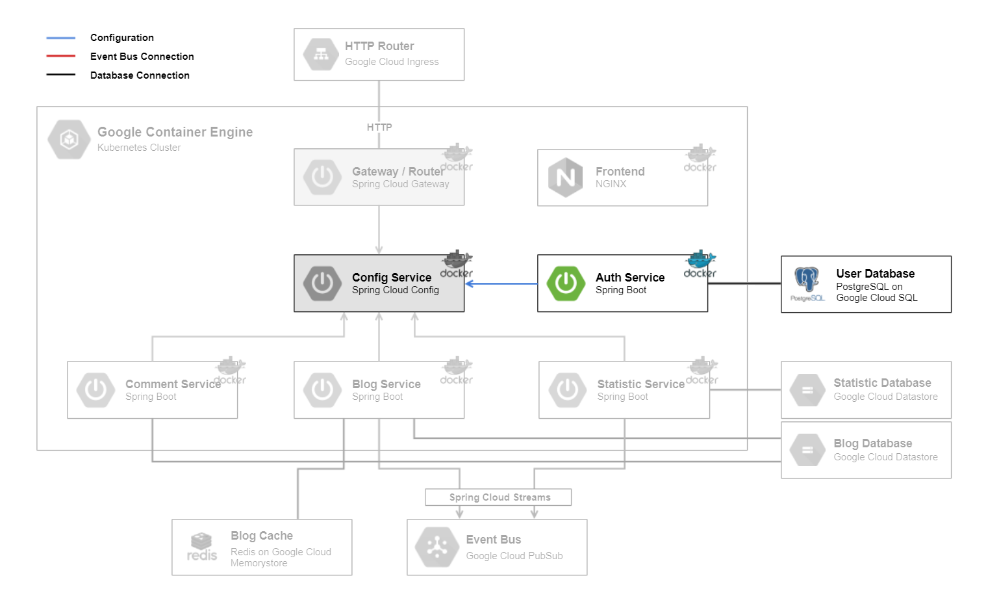

# Auth Service

The [Auth Service](../authmicroservice) backend is a [Spring Boot](https://spring.io/projects/spring-boot) application. It is responsible for the creation and verification of user accounts over [JSON Web Tokens (JWT)](https://jwt.io/).
On startup it loads the configuration of the [Config Service](../configmicroservice).
To store the user data, it uses the `User Database`, a [PostgreSQL](https://www.postgresql.org/) database in [Google Cloud SQL](https://cloud.google.com/sql/).

## Technologies

This microservice consists of following technologies:
* [Spring Boot](https://spring.io/projects/spring-boot)
* [JSON Web Tokens (JWT)](https://jwt.io/)
* [PostgreSQL](https://www.postgresql.org/)
* [Google Cloud SQL](https://cloud.google.com/sql/)

## Dependencies

### Microservices:

* [Config Service](../configmicroservice)

### Components:

* `User Database`

## Local Deploy

On the local deploy, the application get started with profile `dev` with command `gradlew bootRun`.

## Cloud Deploy

The following steps are made for cloud deployment:
* create cloud sql instance with postgresql database
* create service account and secret
* build
* create docker image
* push docker image to google cloud
* create deployment and service in kubernetes cluster
* actualize deployment

For further information have a look at the files `setup-cloud-microservice.bat` & `setup-cloud-microservice.sh` as they are being executed.
