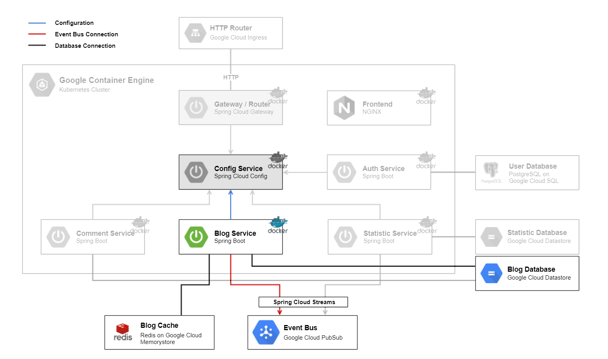

# Blog Service

The [Blog Service](../blogmicroservice) backend is a [Spring Boot](https://spring.io/projects/spring-boot) application. It is the core domain and manages the blogs and posts.
On startup it loads the configuration of the [Config Service](../configmicroservice).
To store the blog data, it uses the `Blog Database`, a [Google Cloud Datastore](https://cloud.google.com/datastore/) and caches the blog data in `Blog Cache` a [Google Cloud Memorystore](https://cloud.google.com/memorystore/) for [Redis](https://redis.io/). 
It also interacts with the `Event Bus`, a [Google Cloud PubSub](https://cloud.google.com/pubsub/), where other microservices can subscribe to.

## Technologies

This microservice consists of following technologies:
* [Spring Boot](https://spring.io/projects/spring-boot)
* [Google Cloud Datastore](https://cloud.google.com/datastore/)
* [Google Cloud Memorystore](https://cloud.google.com/memorystore/) and [Redis](https://redis.io/)
* [Google Cloud PubSub](https://cloud.google.com/pubsub/)

## Dependencies

### Microservices

* [Config Service](../configmicroservice)

### Components

* `Blog Database`
* `Event Bus`
* `Blog Cache`

## Local Deploy

On the local deploy, the application get started with profile `dev` with command `gradlew bootRun`.

## Cloud Deploy

The following steps are made for cloud deployment:
* create service account and secret
* create redis instance
* build
* create docker image
* push docker image to google cloud
* create deployment and service in kubernetes cluster
* actualize deployment

For further information have a look at the files `setup-cloud-microservice.bat` & `setup-cloud-microservice.sh` as they are being executed.
