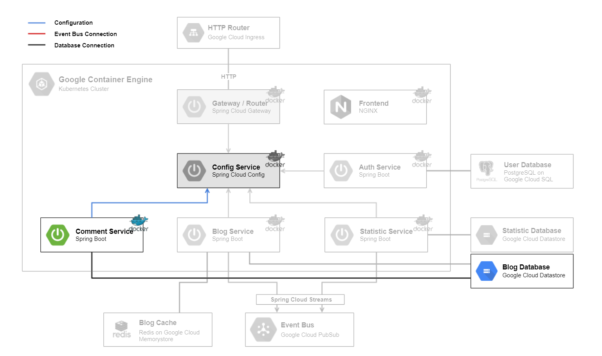

# Comment Service

The [Comment Service](../commentmicroservice) backend is a [Spring Boot](https://spring.io/projects/spring-boot) application. It is responsible for the comments of the blog posts.
On startup it loads the configuration of the [Config Service](../configmicroservice).
To store the comment data, it uses the `Blog Database`.

## Technologies

This microservice consists of following technologies:
* [Spring Boot](https://spring.io/projects/spring-boot)
* [Google Cloud Datastore](https://cloud.google.com/datastore/)

## Dependencies

### Microservices:

* [Config Service](../configmicroservice)

### Components:

* `Blog Database`

## Local Deploy

On the local deploy, the application get started with profile `dev` with command `gradlew bootRun`.

## Cloud Deploy

The following steps are made for cloud deployment:
* create service account and secret
* build
* create docker image
* push docker image to google cloud
* create deployment and service in kubernetes cluster
* actualize deployment

For further information have a look at the files `setup-cloud-microservice.bat` & `setup-cloud-microservice.sh` as they are being executed.
