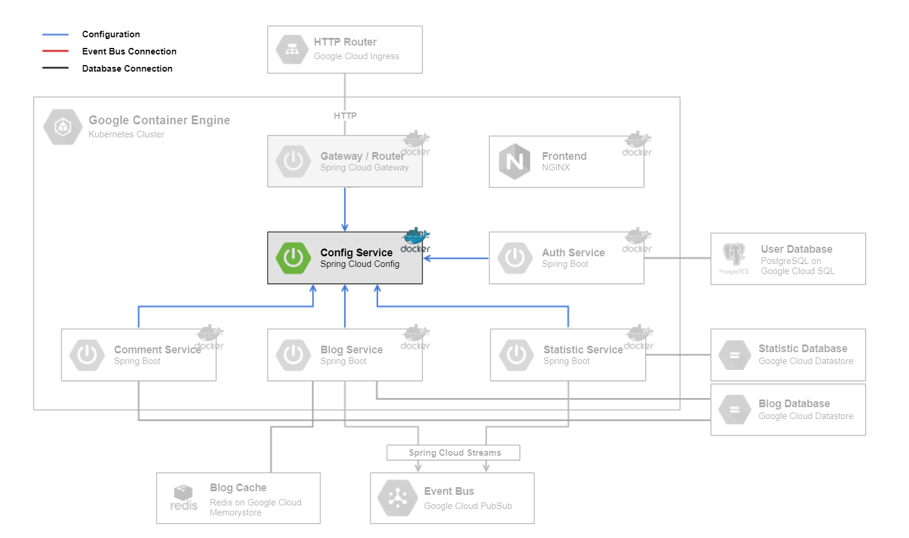

# Config Service

The [Config Service](../configmicroservice) backend is a [Spring Cloud Config](https://spring.io/projects/spring-cloud-config) server. It provides the configuration for most of the microservices. 
On any time, they can pull their configuration.

## Technologies

This microservice consists of following technologies:
* [Spring Cloud Config](https://spring.io/projects/spring-cloud-config)

## Dependencies

This microservice doesn't depend on any other microservice. In order to serve the configuration, configuration file names must be equal to `spring.application.name` of the corresponding microservice.

## Local Deploy

On the local deploy, the application get started with profile `native, dev` with command `gradlew bootRun`.

## Cloud Deploy

The following steps are made for cloud deployment:
* build
* create docker image
* push docker image to google cloud
* create deployment and service in kubernetes cluster
* actualize deployment

For further information have a look at the files `setup-cloud-microservice.bat` & `setup-cloud-microservice.sh` as they are being executed.
