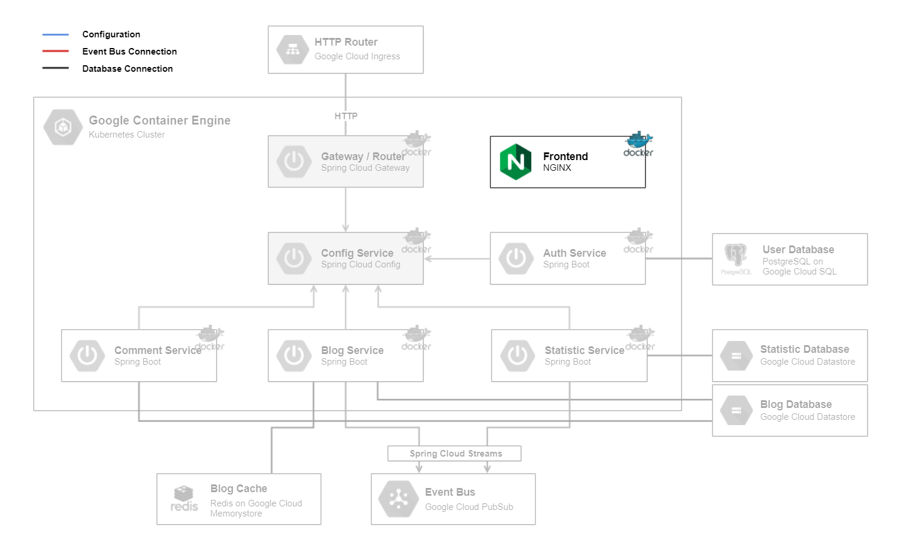

# Frontend

The `Frontend` is a static [Angular](https://angular.io/) webpage with [Bootstrap](https://getbootstrap.com/), served by a [NGINX](https://www.nginx.com/) webserver.

## Technologies

This microservice consists of following technologies:
* [Angular](https://angular.io/)
* [Bootstrap](https://getbootstrap.com/)
* [NGINX](https://www.nginx.com/)

## Dependencies

This component doesn't depend on any other microservice.

## Local Deploy

On the local deploy, the application get started in development mode with command `ng serve`.

## Cloud Deploy

The following steps are made for cloud deployment:
* install dependencies
* build
* create docker image
* push docker image to google cloud
* create deployment and service in kubernetes cluster
* actualize deployment

For further information have a look at the files `setup-cloud-microservice.bat` & `setup-cloud-microservice.sh` as they are being executed.
