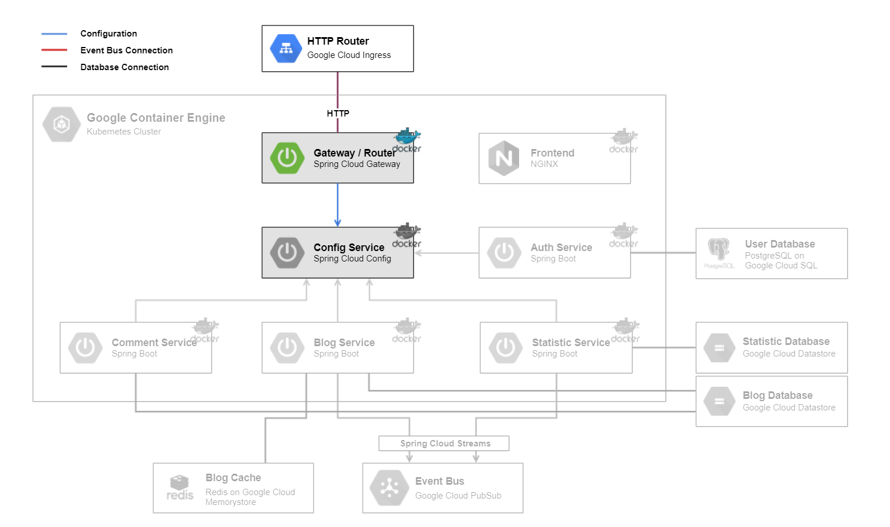

# Gateway / Router

The [Gateway / Router](../gatewaymicroservice) backend is a [Spring Cloud Gateway](http://spring.io/projects/spring-cloud-gateway) server. It is responsible for the routing to the [Frontend](../frontend) as well to the microservices.
On startup it loads the configuration of the [Config Service](../configmicroservice).
The [Gateway / Router](../gatewaymicroservice) is accessible through the `HTTP Router`, a [Google Cloud Ingress](https://cloud.google.com/kubernetes-engine/docs/concepts/ingress).

## Technologies

This microservice consists of following technologies:
* [Spring Cloud Gateway](http://spring.io/projects/spring-cloud-gateway)
* [Google Cloud Ingress](https://cloud.google.com/kubernetes-engine/docs/concepts/ingress)

## Dependencies

### Microservices:

* [Config Service](../configmicroservice)

### Components:

* `HTTP Router`

## Local Deploy

On the local deploy, the application get started with profile `dev` with command `gradlew bootRun`.

## Cloud Deploy

The following steps are made for cloud deployment:
* build
* create docker image
* push docker image to google cloud
* create deployment and service in kubernetes cluster
* actualize deployment

For further information have a look at the files `setup-cloud-microservice.bat` & `setup-cloud-microservice.sh` as they are being executed.
